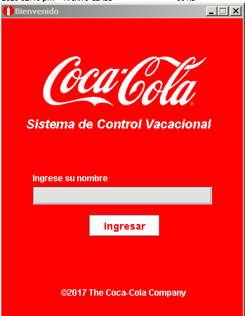
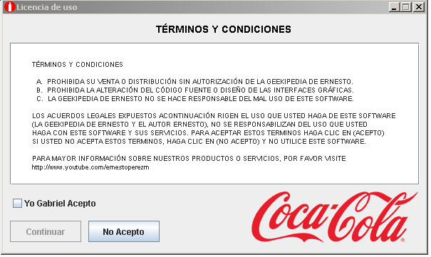
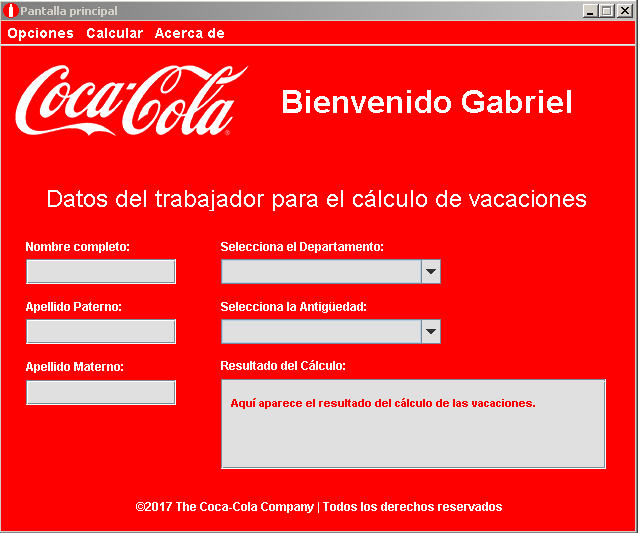

# Practic de Curso Java Inicio

Jaava 1er curso desde el inicio conceptos basicos de la programacion usado en java y manejo de los componentes visuales y creacion formularios, usando el bloc de notas y la terminal.
## Contenido

- Principios basico de programacion en Java.

- Forma de arrancar un archivo .java.

- Usos basico de la consola.

- Variables.

- Manejo de cadenas de texto (String).

- Sentencias condicionales.

- Ciclos y Bucles.

- Desarrollo de la logica.

- Operadores aritmeticos logicos y relcionales.

- Analisis y resolucion de problemas.

- Arreglos unidimensionales y bidimensionales.

- Arreglos dinamicos y estaticos.

- Arreglos bidimensionales dinamicos.

- Sucesion Fibonacci.

- Manejo de componentesvisuales.

- Construccion de formularios

- Construcion de interfaces.

- Proyecto final.

## Resumen y Analisis

- Java: Java es un lenguaje de programación orientado a objetos ampliamente utilizado. Es conocido por su portabilidad y su capacidad para ejecutarse en diferentes plataformas sin necesidad de recompilar el código fuente.

- JDK (Java Development Kit): El JDK es un conjunto de herramientas y bibliotecas necesarias para desarrollar, compilar y ejecutar aplicaciones en Java. Incluye el compilador de Java (javac), la máquina virtual de Java (JVM) y otras utilidades esenciales.

- Consola de Windows: La consola de Windows es una interfaz de línea de comandos que permite interactuar con el sistema operativo. En la consola de Windows, puedes ejecutar comandos y programas, incluidas las herramientas de desarrollo de Java.

- Bloc de notas: El Bloc de notas es un editor de texto simple que se encuentra en la mayoría de los sistemas operativos de Windows. Aunque puedes utilizarlo para escribir código Java, no es un entorno de desarrollo completo y carece de características avanzadas específicas para la programación en Java.

- Principios básicos de programación en Java: Los principios básicos de programación en Java incluyen el uso de sintaxis Java, la comprensión de los tipos de datos, la declaración de variables, la estructura de control (condicionales y bucles), la modularización del código en métodos y la orientación a objetos.

- Forma de arrancar un archivo .java: Para ejecutar un archivo Java (.java), debes compilarlo primero utilizando el comando javac en la línea de comandos. Luego, puedes ejecutar el archivo compilado utilizando el comando java seguido del nombre de la clase principal.

- Uso básico de la consola: La consola se utiliza para interactuar con un programa a través de comandos. Puedes compilar y ejecutar programas Java, mostrar mensajes en la consola, leer la entrada del usuario y mostrar resultados.

- Variables: Las variables en Java son contenedores para almacenar datos. Deben declararse con un tipo de dato específico y pueden cambiar su valor a lo largo del programa. Se utilizan para almacenar y manipular información.

- Manejo de cadenas de texto (String): Las cadenas de texto, representadas por la clase String en Java, se utilizan para almacenar y manipular secuencias de caracteres. Puedes concatenar cadenas, obtener la longitud, extraer subcadenas y realizar otras operaciones con ellas.

- Sentencias condicionales: Las sentencias condicionales, como if, else if y else, permiten ejecutar diferentes bloques de código según una condición booleana. Estas estructuras controlan el flujo del programa y toman decisiones basadas en condiciones.

- Ciclos y bucles: Los ciclos y bucles, como for, while y do-while, permiten repetir un bloque de código varias veces. Se utilizan para automatizar tareas repetitivas o procesar una serie de elementos.

- Desarrollo de la lógica: El desarrollo de la lógica se refiere a la habilidad de pensar y crear algoritmos para resolver problemas. Implica diseñar un enfoque estructurado y paso a paso para solucionar un problema utilizando conceptos de programación.

- Operadores aritméticos, lógicos y relacionales: Los operadores aritméticos se utilizan para realizar operaciones matemáticas; los operadores lógicos se utilizan para combinar o negar expresiones booleanas; y los operadores relacionales se utilizan para comparar valores y devolver un resultado booleano.

- Análisis y resolución de problemas: El análisis y resolución de problemas implica descomponer un problema en partes más pequeñas, identificar los requisitos y definir un enfoque sistemático para encontrar una solución. Implica el uso de habilidades lógicas y técnicas de programación.

- Arreglos unidimensionales y bidimensionales: Los arreglos unidimensionales son estructuras de datos que almacenan elementos del mismo tipo en una secuencia lineal. Los arreglos bidimensionales son matrices rectangulares que almacenan elementos en filas y columnas.

- Arreglos dinámicos y estáticos: Los arreglos estáticos tienen un tamaño fijo que se determina en tiempo de compilación y no puede cambiar durante la ejecución. Los arreglos dinámicos, como ArrayList, pueden cambiar de tamaño en tiempo de ejecución y proporcionan métodos para agregar, eliminar y acceder a los elementos.

- Arreglos bidimensionales dinámicos: En Java, los arreglos bidimensionales dinámicos se pueden implementar utilizando un arreglo de arreglos (int[][] matriz). Esto permite tener filas de diferentes longitudes en una matriz.

- Sucesión Fibonacci: La sucesión de Fibonacci es una secuencia numérica en la que cada número es la suma de los dos anteriores. Se puede implementar utilizando ciclos o recursión para generar los números de la sucesión.

- Manejo de componentes visuales: En Java, el manejo de componentes visuales se refiere a la creación y manipulación de elementos gráficos de una interfaz de usuario, como botones, etiquetas, campos de texto, etc. Esto se realiza utilizando bibliotecas de GUI como Swing o JavaFX.

- Construcción de formularios: En Java, la construcción de formularios se refiere a la creación de interfaces gráficas que contienen componentes interactivos para que el usuario ingrese datos o realice acciones. Esto se puede lograr utilizando herramientas de diseño visual en IDEs como NetBeans o utilizando código Java para crear y posicionar los componentes.

- Construcción de interfaces: La construcción de interfaces en Java implica la creación de interacciones visuales entre el usuario y la aplicación. Se pueden implementar mediante el diseño de ventanas, paneles, menús, barras de herramientas y otros elementos que faciliten la interacción y la experiencia del usuario.
## Instalacion y Ejecucion

[JDK 8](https://www.oracle.com/java/technologies/javase/javase8-archive-downloads.html)

niciar en Java: Para comenzar a programar en Java, puedes seguir estos pasos básicos:

- Descarga e instala el JDK en tu sistema.

- Configura las variables de entorno del JDK para que el sistema pueda encontrar las herramientas de desarrollo de Java.

- Abre el Bloc de notas y escribe tu código Java en un nuevo archivo con la extensión .java.

- Guarda el archivo con un nombre significativo y la extensión .java.

- Abre la consola de Windows y navega hasta la ubicación del archivo Java utilizando el comando cd.

- Utiliza el compilador de Java (javac) para compilar tu archivo Java. Por ejemplo: javac MiArchivo.java.

- Si no hay errores de compilación, ejecuta el programa utilizando el intérprete de Java (java). Por ejemplo: java MiArchivo.

## Proyecto Final

Como desarrollo del proyecto final se realizo una aplicacion sencilla, basada en coca-cola.

La app cuenta con 3 modulos, y su funcion es laa de calcular los dias de vacaciones que le corresponde a un trabajador segun su cargo y años de lbor en l empresa, para esto se debe iniciar la app con un usuario y aceptar los terminos de la licencia.

- Login

- Lincencia

- Interfaz Principal

## Authors

- [@GabrielTorrealba](https://github.com/GabrielJose2102)

